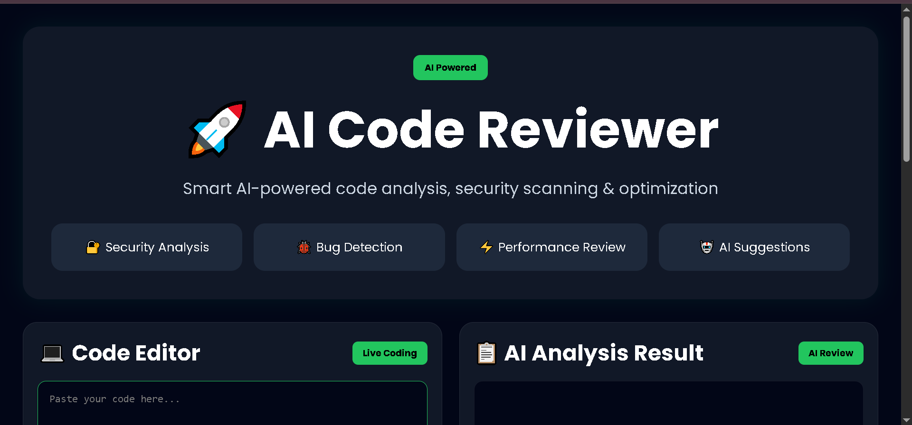

# 🚀 AI Code Reviewer

An AI-powered code review platform built using Flask, Groq API, Docker, NGINX, and Gunicorn.

This project analyzes code for:

* 🔐 Security Issues
* 🐞 Bugs & Vulnerabilities
* ⚡ Performance Improvements
* 📋 Best Practices
* 🤖 AI Suggestions

---

# 🌐 Live Demo

## Website

```bash
http://vivek.cloud
```

---

# 📸 Project Preview
<h1>🎬 Project Demo</h1>

<p align="center">
  <a href="/project-demo.mp4">
    
  </a>
</p>


## AI Code Analysis
.png)

---

# 🛠️ Tech Stack

## Backend

* Python
* Flask
* Groq API

## Frontend

* HTML
* CSS
* JavaScript

## DevOps & Deployment

* Docker
* NGINX
* Gunicorn
* Linux
* AWS EC2
* Custom Domain

---

# ✨ Features

* AI-powered code analysis
* Modern SaaS-style UI
* Security vulnerability detection
* Bug identification
* Optimization suggestions
* Responsive design
* Production deployment setup
* Docker support
* Domain hosting

---

# 📂 Project Structure

```bash
ai-code-reviewer/
│
├── app.py
├── requirements.txt
├── Dockerfile
├── .dockerignore
├── .env
│
├── templates/
│   └── index.html
│
├── static/
│
└── venv/
```

---

# ⚙️ Installation & Setup

## 1. Clone Repository

```bash
git clone https://github.com/YOUR_USERNAME/ai-code-reviewer.git
```

```bash
cd ai-code-reviewer
```

---

## 2. Create Virtual Environment

```bash
python3 -m venv venv
```

Activate environment:

### Linux/Mac

```bash
source venv/bin/activate
```

### Windows

```bash
venv\Scripts\activate
```

---

## 3. Install Dependencies

```bash
pip install -r requirements.txt
```

---

## 4. Add Environment Variables

Create `.env` file:

```env
GROQ_API_KEY=your_api_key
```

---

## 5. Run Flask App

```bash
python app.py
```

Open:

```bash
http://127.0.0.1:5000
```

---

# 🐳 Docker Setup

## Build Docker Image

```bash
docker build -t ai-code-reviewer .
```

---

## Run Docker Container

```bash
docker run -d -p 5000:5000 --name ai-reviewer-container --env-file .env ai-code-reviewer
```

---

## Check Running Containers

```bash
docker ps
```

Paste this:


---

## 📦 Pull Docker Image From Docker Hub

```bash
docker pull chopadevivek07/ai-code-reviewer:latest
---
```

## ▶️ Run Docker Image
```
docker run -p 5000:5000 chopadevivek07/ai-code-reviewer:latest
```

# 🌍 Production Deployment

This project is deployed using:

* Gunicorn
* NGINX Reverse Proxy
* Linux Server
* AWS EC2
* Custom Domain

---

# 🔥 What I Learned

Through this project I learned:

* Flask backend development
* AI API integration
* Docker containerization
* Linux server management
* Gunicorn setup
* NGINX reverse proxy configuration
* Domain & DNS setup
* Production deployment workflow
* Environment variable management

---

# 👨‍💻 Developer

## Vivek Chopade

MCA Student | AWS & DevOps Engineer (Fresher) | Cloud & Automation Enthusiast 🚀

### Connect With Me

* GitHub: [https://github.com/chopadevivek07](https://github.com/chopadevivek07)
* LinkedIn: [https://www.linkedin.com/in/vivek-chopade07/](https://www.linkedin.com/in/vivek-chopade07/)
* Medium: [https://medium.com/@chopadevivek4466](https://medium.com/@chopadevivek4466)

---

# ⭐ Support

If you liked this project, give it a ⭐ on GitHub.
